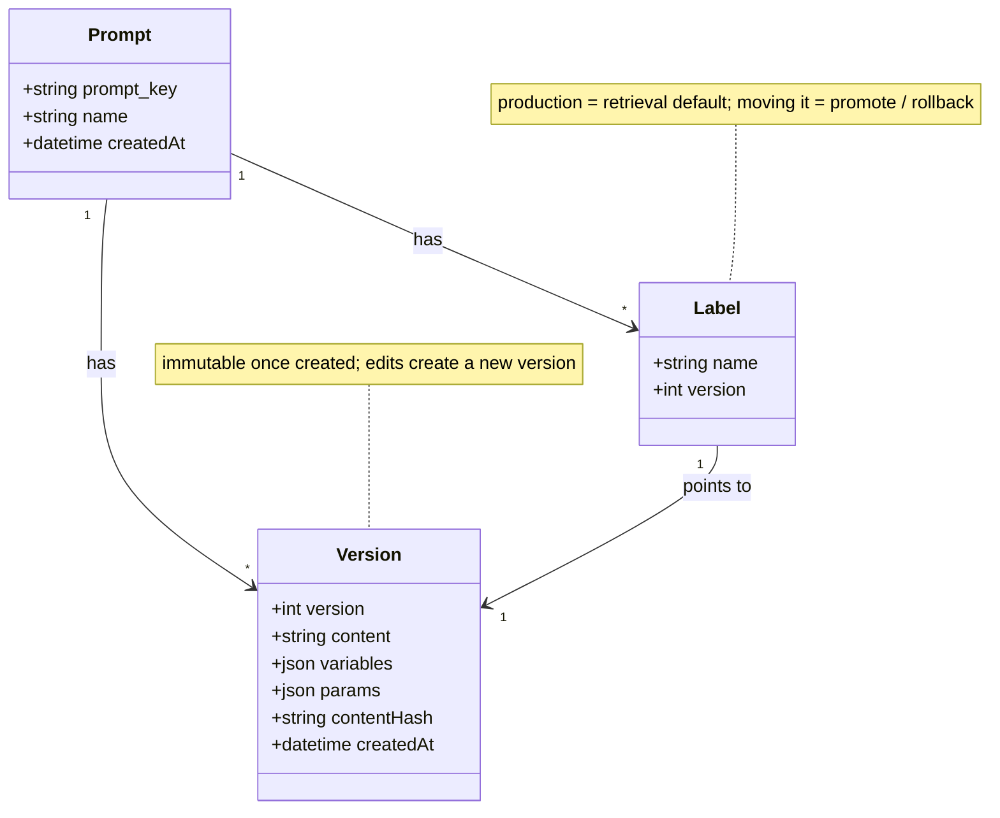
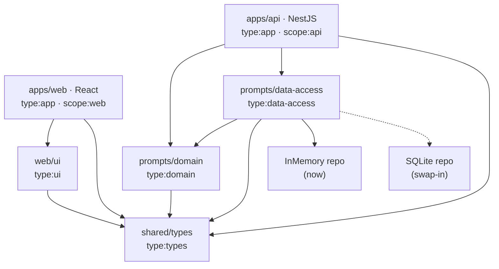
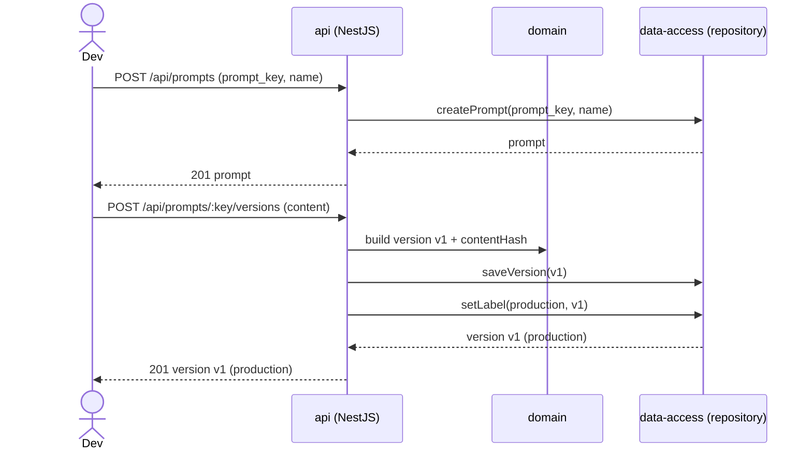
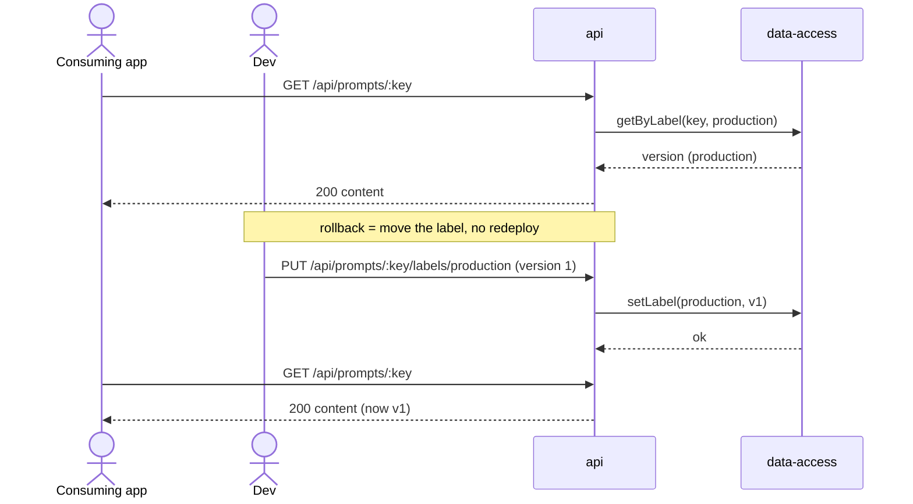

# HLD — Prompt Versioning Service

High-level design for the MVP in [`prd.md`](prd.md). Diagrams are Mermaid (they
render on GitHub and in any Mermaid viewer). The design choices sketched here are
formalised as ADRs — see [`decisions.md`](decisions.md).

## Domain model

A **Prompt** owns many immutable **Versions**. A **Label** is a named pointer to a
single version; `production` is the retrieval default, and moving it is
promote / rollback.

## Architecture & module boundaries

Nx layers in `apps/` and `libs/`. Every arrow below is **enforced** by
`@nx/enforce-module-boundaries` — the build fails if anyone crosses a line.
`domain` depends only on `types` (never on `data-access`), and `web` can only
reach `web` libs + `shared` (never server internals). Storage sits behind the
data-access repository interface: an in-memory adapter now, a SQLite adapter as a
documented swap-in.

## Sequence — create prompt + first version (auto-promote)

The first version of a prompt is automatically labelled `production`, so a
default fetch works immediately.

## Sequence — retrieve default & rollback

Rollback is just moving the `production` label to an earlier version — no
redeploy.

